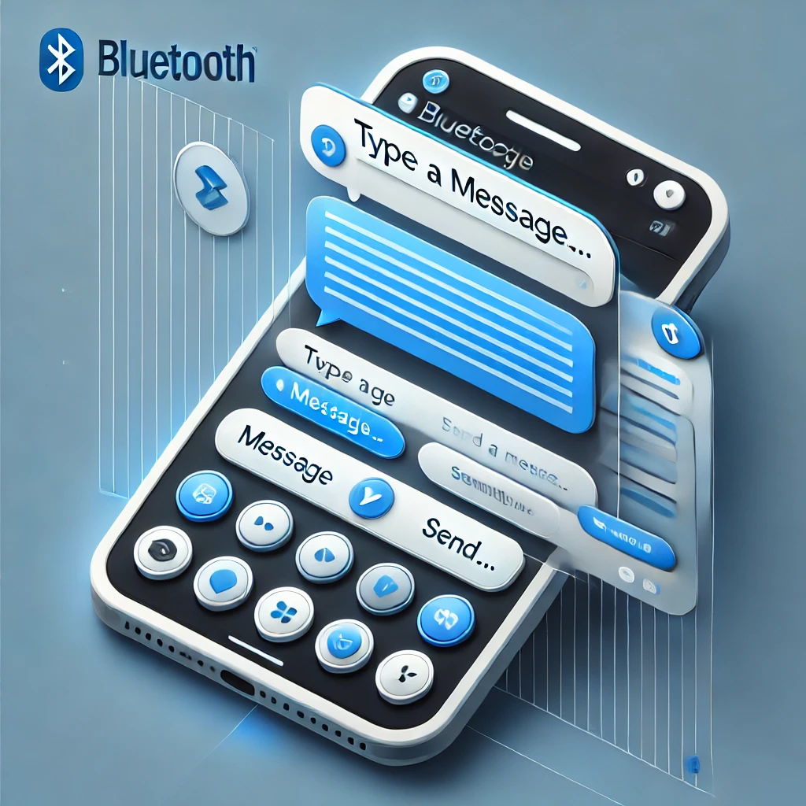

---

# Bluetooth Chat Project

This project is a simple Bluetooth chat application developed using Python. It allows two devices (e.g., smartphones, computers) to communicate with each other over Bluetooth.

## Features

- Bidirectional communication over Bluetooth
- Message sending and receiving
- Simple graphical user interface (GUI)

## Prerequisites

- Python 3.x
- PyBluez library (`pip install pybluez`)

## Getting Started

### Installation

1. Clone the repository:
   ```bash
   git clone https://github.com/yourusername/bluetooth-chat.git
   ```

2. Navigate to the project directory:
   ```bash
   cd bluetooth-chat
   ```

3. Install required libraries:
   ```bash
   pip install pybluez
   ```

### Running the Project

1. Start the server:
   ```bash
   python server.py
   ```

2. On another device, start the client:
   ```bash
   python client.py
   ```

3. Pair the devices via Bluetooth if not already paired.

4. Start chatting!

## Project Structure

- `server.py`: Contains the Bluetooth server logic.
- `client.py`: Contains the Bluetooth client logic.
- `README.md`: This file.
- `image.png`: Optional: A sample image or UI screenshot.

## Screenshot



## Acknowledgments

- PyBluez library for Bluetooth communication
- OpenAI for generating this README template

---

Replace `"image.png"` with your actual image file if you have a screenshot or diagram. Let me know if you need further customization!
